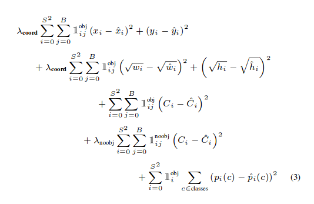
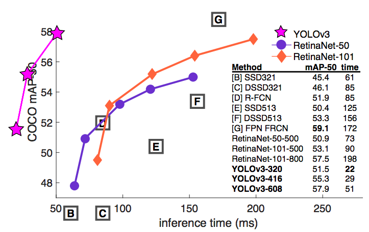

# Tổng quan

- Hai vấn đề chính: 
    - vấn đề 1: Phân loại ảnh để biết đối tượng trong ảnh là chó hay mèo là 1 vấn 
    đề.
        - được giải quyết bằng mạng neural network
    - vấn đề 2: Phát hiện đối tượng trong ảnh đồng thời với vị trí của đối tượng
        - giải quyết bằng Yolo neural net.

# YOLO 
 

Yolo là một mạng neural có khả năng phát hiện 
trong ảnh là đối tượng gì 
và vị trí của nó ở đâu trong ảnh. Nó tạo ra các 
bounding box xung quanh các đối tượng, có thể phát hiện nhiều đối
tượng cùng lúc (cho nên nó có tên là You look only once). 

YOLO là thuật toán mà phát hiện vật thể ở tốc độ cao nhưng 
độ chính xác thì không cao, cho nên nó là một sự lựa chọn tốt 
khi chúng ta cần các real-time detection.

#### YOLO v1 
Ra đời tháng 5, 2016

Lấy cảm hứng từ GoogleNet. Gồm 24 convolutional layers làm nhiệm vụ 
feature extractors và 2 dense layers làm nhiệm vụ predictions. 

#### YOLO v2
Ra đời tháng 12, 2016

Sửa lỗi khi mà các object ở gần nhau 

YOLOv2 giới một số tính năng mới: anchor boxes

Ở thời điểm của YOLOv2 thì độ chính xác của nó kém các thuật toán 
như là RetinaNet và SSD nhưng về mặt tốc độ thì nó là thuật toán 
nhanh nhất. 

YOLOv2 sử dụng một phiên bản tùy chỉnh của darknet-19 bằng cách bổ sung thêm 
11 layers cho việc phát hiện đối tượng. Với 30 layers YOLO thường 
phải vật lộn với các vật thể nhỏ. 
Lý do là:

    This was attributed to loss of fine-grained features 
    as the layers downsampled the input

Để xử lý điều này, YOLOv2 đã 

    To remedy this, YOLO v2 used an identity mapping, 
    concatenating feature maps from from a previous layer to 
    capture low level features.
   
Nhưng YOLOv2 lại không có các yếu tố rất quan trọng mà hầu hết 
các thuật toán hiện nay đều có. Đó là không có 

    No residual blocks, no skip connections and no upsampling.
    YOLO v3 incorporates all of these.

#### YOLO v3 and Darknet-53

YOLO sửa dụng một biến thể của Darknet, cái mà ban đầu có 53 layer
network được trained ở Imagenet. Cho nhiệm vụ detection, 53 layers 
nữa được đặt thêm vào, và chúng có tổng 106 layers fully convolutional 
dưới cấu trúc của YOLOv3. Đó là lý do cho sự chậm của YOLOv3 so với 
YOLOv2. 

 
 
 ##### Detection với 3 tỷ lệ 
 
 The newer architecture boasts of residual skip connections, and upsampling. The most salient feature of v3 is that it makes detections at three different scales. YOLO is a fully convolutional network and its eventual output is generated by applying a 1 x 1 kernel on a feature map. In YOLO v3, the detection is done by applying 1 x 1 detection kernels on feature maps of three different sizes at three different places in the network.
The shape of the detection kernel is 1 x 1 x (B x (5 + C) ). Here B is the number of bounding boxes a cell on the feature map can predict, “5” is for the 4 bounding box attributes and one object confidence, and C is the number of classes. In YOLO v3 trained on COCO, B = 3 and C = 80, so the kernel size is 1 x 1 x 255. The feature map produced by this kernel has identical height and width of the previous feature map, and has detection attributes along the depth as described above.
 
 

 
 Ngoài residual skip connections và upsampling. Một tính 
 năng quan trong nhất của v3 là nó tạo ra các detection với 3
 tỷ lệ khác nhau 
 
 Thì từ một ảnh ở size 416 px. Qua các conv layers sẽ bị giảm 
 kích cỡ xuống. hoặc tăng lên khi có Upsampling Layer.
 
 v3 dự đoán ở 3 scales là 32, 16, 8
 
 32, 16, 8 ở đây được định nghĩa là stride của network. (sải của mạng)
 
 ví dụ đầu vào của ảnh là 416px. Mà stride của network là 32 thì tức là 
 feature map sẽ có size là 13x13
 
 
     Dự đoán đầu tiên được thực hiện ở layer thứ 82 (sải là 32)
     
     feature map sẽ có size là 13x13x255  

sau đó từ layer 79 trải qua vài Conv rồi sampleup lên 26x26.
feature map này được `depth concatenated`  (dấu hoa th) với layer 61

rồi qua vài conv và 

    Dự đoán thứ 2 được thực hiện ở layer 94 (sải 16) 
    
    feature map sẽ có size 26x26x255 

Quá trình tiếp tục đến lần dự đoán cuối cùng:

    Dự đoán thứ 2 được thực hiện ở layer 106 (sải 8) 
    
    feature map sẽ có size 52x52x255
    
#### Better at detecting smaller objects

Kỹ thuật upsampled kết hợp với concatenate với các layers trước giúp 
bảo tồn `fine grained features` (làm min các features) giúp cho xác định 
các vật thể nhỏ. 

Layer 13x13 làm nhiệm vụ phát hiện các vật thể to, trong khi 52x52 giúp 
phát hiện các vật thể nhỏ, còn 26x26 giúp phát hiện các vật thể cỡ 
trung bình 

bởi vì các grid tăng là tăng dần cho nên ở scale cuối sẽ có nhiều grid 
nhất, và các grid đó có cỡ nhỏ nhất, cho nên có khả năng phát hiện 
ra các vật thể nhỏ.

#### Choice of anchor boxes

YOLOv3 sử dụng tổng 9 anchor boxes. 3 cho mỗi scale, Nếu bạn trainiing 
YOLO bằng dataset của bạn thì bạn sẽ phải sử dụng K-Means để phân cụm các 
9 anchors.

Sau đó sắp xếp các anchors theo thứ tự giảm dần của dimension. Gán 3 anchors lớn nhất 
cho first scale, 3 cái tiếp cho second scale, và 3 cái cuối cho thrid 
scale 

#### Tăng bouding boxes cho mỗi ảnh 

Với 1 ảnh đầu vào, YOLOv3 dự đoán nhiều bounding boxes hơn so với 
YOLOv2. ví dụ với độ phân giải 416x416, YOLO v2 dự đoán 13x13x5 = 
845 boxes. 

còn với YOLOv3 thì có 3 scales, nên với 1 ảnh 416x416 thì số sẽ có: 
13x13x3 + 26x26x3 + 52x52x3 = 10,647 boxes. Như vậy YOLO dự đoán số lượng 
box lớn gấp 10 so với YOLOv2 cho nên tốc độ của nó bị giảm. 

#### Sự thay đổi hàm mất mát 
Đây là công thức hàm mất mát ở YOLO v2 và v1:

Nhìn vào 3 hạng tử cuối cùng của công thức. Chúng ta thấy rằng 

hạng tử đầu là phạt cho  object confidence (tức là có vật thể hay không)

giả sử có vật thì C mũ ở biểu thức 1 sẽ gần 1
C mũ ở biểu thức 2 sẽ gần 0

Biểu thức thứ 3 cho xác suất của các class. 

Tức là YOLO v2 sẽ sử dụng squared errors. Trong khi YOLO v3 sẽ thay thế bằng hàm 
cross - entropy. Nói cách khác,  object confidence and class predictions 
được dự đoán thông qua logistic regression ? (vì thực chất hồi quy 
sofmax chỉ là trường hợp tổng quát lên của hồi quy logistic.) 

#### No more softmaxing the classes
##### YOLO v3 now performs multilabel classification for objects detected in images.
Earlier in YOLO, authors used to softmax the class scores and take the class with maximum 
score to be the class of the 
object contained in the bounding box. This has been modified in YOLO v3.

Softmaxing classes rests on the assumption that classes are mutually exclusive, or in 
simple words, if an object belongs to one class, then it cannot belong to the other. 
This works fine in COCO dataset.

However, when we have classes like Person and Women in a dataset, 
then the above assumption fails. This is the reason why the authors of 
YOLO have refrained from softmaxing the classes. Instead, each class score is 
predicted using logistic regression and a threshold is used to predict multiple 
labels for an object. Classes with scores higher than this threshold are assigned to the box. 

#### Benchmarking

