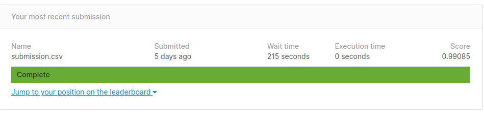

## Phân loại các chữ số:
### 1. Data

- Train: `(42000, 784)` 
    - Tức là bao gồm `42000` ảnh `28x28` pixels
- Test: `(28000, 784)`
    - Tức là gồm `28000` ảnh `28x28` pixels
- Giá trị ở mỗi phần tử trong các ma trân trên đều nằm trong khoảng `[0-1]`   
### 2. Model
- Thông tin xem ở file `digit_model.py`

### 3. Xử lý data
- Thông tin ở trong đoạn code trong file `create_dataset.py`
```python
transform=transforms.Compose(
    [transforms.ToPILImage(), RandomRotation(degrees=20), RandomShift(3),
     transforms.ToTensor(), transforms.Normalize(mean=(0.5,), std=(0.5,))])
```
- Chuyển sang dạng ảnh PIL
- Sử dụng hàm RandomRotation và RandomShift
- Chuyển sang dạng Tensor
- Normalize về `[-1, 1]`


### 4. Thông số train
- Hàm loss: `CrossEntropyLoss`
- Hàm tối ưu `Adam`
    - Learning rate: `0.003`
- lr_scheduler: `step_size=7`, `gamma=0.1`
- batch size: `64`
- epochs: `1`

### 5. Kết quả train
```console
Train Epoch: 0 [6400/42000 (15%)]	Loss: 0.639049
Train Epoch: 0 [12800/42000 (30%)]	Loss: 0.256713
Train Epoch: 0 [19200/42000 (46%)]	Loss: 0.135708
Train Epoch: 0 [25600/42000 (61%)]	Loss: 0.419920
Train Epoch: 0 [32000/42000 (76%)]	Loss: 0.174030
Train Epoch: 0 [38400/42000 (91%)]	Loss: 0.116544

Average loss: 0.0977, Accuracy: 40739/42000 (96.000%)
```

### 6. Kết quả trên tập test
- Đạt 99%
